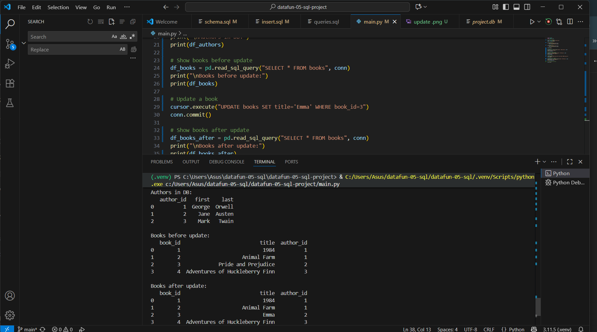

# datafun-05-sql-project
# Project 5: Python + SQL
datafun-05-sql-project
Project 5: Python + SQL

This project demonstrates how to use Python with SQL to manage relational data.
It combines sqlite3 for database operations and pandas for querying and displaying results.

We create two related tables:

authors (author_id, first, last)

books (book_id, title, author_id)

The relationship is one-to-many (one author, many books).

Features

Define schema using schema.sql

Insert sample data with insert.sql

Query tables before and after updates

Update book records

Display results in clean pandas DataFrames

Project Structure
datafun-05-sql-project/
│
├── sql/
│   ├── schema.sql       # table definitions
│   ├── insert.sql       # insert sample data
│   └── queries.sql      # additional queries
│
├── screenshots/         # execution results
│   └── update.png       # proof of update query
│
├── main.py              # main Python script
├── project.db           # SQLite database
├── requirements.txt     # dependencies
└── README.md            # project documentation

Installation

Clone this repo:

git clone https://github.com/batyrovbahrom96-svg/datafun-05-sql-project.git
cd datafun-05-sql-project

Create and activate a virtual environment:

python -m venv .venv
.venv\Scripts\activate   # on Windows

Install dependencies:

pip install -r requirements.txt

Usage

Run the main script to build the database, insert data, and run queries:

python main.py

Example Output
Before and After Update

Learning Goals

Work with relational data in SQL

Connect SQL with Python pandas

Practice CREATE, INSERT, SELECT, and UPDATE

Show results in GitHub-friendly format

Links

Specification

Repository
